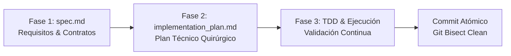

# Protocolo Spec-Driven Development (SDD) & Ciclo de Vida Agéntico

Este documento define el estándar obligatorio de desarrollo guiado por especificaciones (**Spec-Driven Development**) para todos los proyectos del workspace.

---

## 1. Filosofía Fundamental
En el paradigma de ingeniería con agentes de IA:
> **La Especificación (`spec.md`) es el código fuente real.**  
> El código generado (TypeScript, JSX, SQL) es solo el compilado derivado por el modelo.

Si la especificación contiene ambigüedades, el agente alucinará o introducirá deuda técnica. Por ello, **está estrictamente prohibido escribir código de producción o realizar modificaciones arquitectónicas sin una especificación aprobada.**

---

## 2. Las 3 Fases Formales del Ciclo de Vida

### Fase 1: Especificación (`spec.md`)
Antes de implementar cualquier feature o refactorización significativa, se debe redactar o actualizar `spec.md` (ubicado en `.dev/specs/` o en el directorio de la feature).

#### Estructura Obligatoria de `spec.md`:
1. **Contexto y Objetivo de Negocio**: Qué problema resuelve y para quién.
2. **Modelo de Datos y Contratos**:
   - Esquemas TypeScript / Zod explícitos de inputs y outputs.
   - Esquema relacional o tablas de base de datos involucradas (Supabase / Postgres).
3. **Casos Borde y Manejo de Errores**:
   - Estados vacíos (Empty States).
   - Errores de red, timeout o permisos denegados (RLS).
   - Comportamientos concurrentes o entradas inválidas.
4. **Criterios de Aceptación (Formato Given-When-Then / Gherkin)**:
   - Escenarios verificables e inequívocos que determinarán si la feature está completada.

### Fase 2: Plan Técnico Quirúrgico (`implementation_plan.md`)
Una vez aprobada la especificación:
1. Identificar con precisión quirúrgica los archivos a crear (`[NEW]`), modificar (`[MODIFY]`) o eliminar (`[DELETE]`).
2. Diseñar la estrategia de pruebas previa (Unitarias, Contratos, E2E).
3. Identificar dependencias y riesgos de regresión antes de tocar el código.

### Fase 3: Ejecución Guiada por Pruebas & Verificación
1. **TDD / Pruebas Primero**: Cuando aplique a lógica de negocio o utilidades, escribir la prueba que falla antes de la implementación.
2. **Edición Quirúrgica**: Modificar únicamente las líneas necesarias, respetando la Regla del Boy Scout sin introducir cambios cosméticos no relacionados.
3. **Guardarraíl Obligatorio**: Ejecutar `tsc --noEmit`, `npm run lint` y `npm run build` antes de dar por cerrada la tarea.
4. **Commit Atómico**: Empaquetar el cambio bajo Conventional Commits asegurando que sea bisectable.
