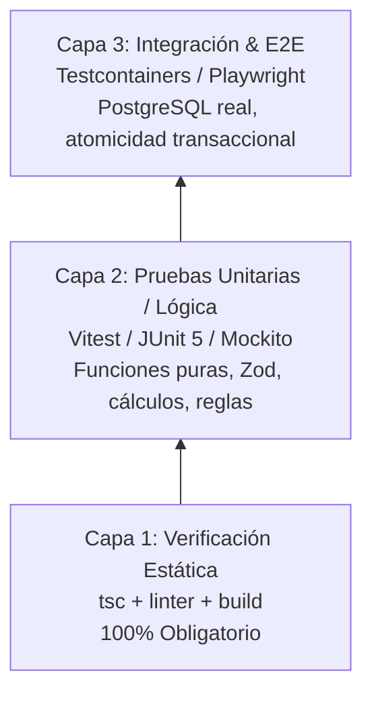

# Pirámide de Pruebas & Calidad Linus Torvalds: Cero Regresiones

Este estándar implementa la disciplina de ingeniería del Kernel de Linux promovida por **Linus Torvalds**: contratos de datos sólidos, cero regresiones para el usuario y commits atómicos bisectables.

---

## 1. La Regla de Oro de Linus Torvalds: "Never Break Userspace"

> *"Las regresiones son inaceptables. Si un cambio rompe el comportamiento esperado de una funcionalidad que antes funcionaba, el cambio es defectuoso, sin importar lo 'limpio' o 'elegante' que sea el nuevo código."*

### Principio de Atomicidad Bisectable (`git bisect` clean):
- Cada commit individual en el historial de Git debe compilar sin errores y pasar sus pruebas unitarias.
- Está terminantemente prohibido hacer commits intermedios con errores de sintaxis, imports rotos o tipos incompletos con la promesa de "arreglarlo en el siguiente commit".

---

## 2. La Pirámide Pragmática de 3 Capas

### Capa 1: Verificación Estática
- Verificación de tipos estricta y análisis estático (Linter + Build) antes de cualquier commit.

### Capa 2: Pruebas Unitarias de Lógica y Dominio
- Deterministas, aisladas, con mocks para repositorios externos y tiempos de ejecución en milisegundos.
- Cobertura de código mínima exigida: $\ge 70\%$ en la capa de negocio.

### Capa 3: Pruebas de Integración con Motores Reales
- Ejecución contra instancias reales (ej. PostgreSQL 16 con Testcontainers) para validar esquemas DDL, transacciones ACID y consultas complejas.

---

## 3. Protocolo de Diagnóstico Científico (Anti-Blind Patching)

Si un comando de validación o build falla:
1. **Pausa Inmediata**: No intentes parches rápidos o adivinanzas de código.
2. **Inspección del Trace Completo**: Lee el log exacto, identifica el archivo y la línea del error.
3. **Hipótesis Concreta**: Explica la causa raíz del fallo.
4. **Corrección Quirúrgica**: Modifica únicamente la causa raíz y vuelve a validar.

---

## 4. Paridad de Entorno CI/CD y "Anti-Falsa Sensación de Verde"

- **Prohibición**: Prohibido dar por verificada una suite de pruebas o cerrar un issue basándose únicamente en corridas locales cuando existan directivas de degradación condicional (ej. `disabledWithoutDocker = true`, mocks de red o flags permisivas).
- **Autoridad Suprema**: El runner de GitHub Actions sobre la rama objetivo (`main`) es la única fuente de verdad. Todo commit de entrega debe verificarse directamente en los logs de ejecución de CI.

---

## 5. Aserción Programática en Pruebas de Persistencia & Rendimiento (N+1)

- **Aserciones Cuantitativas Obligatorias**: En pruebas que comprueben la solución a sobrecarga de consultas o problemas $1 + N$, no basta con verificar que los datos devueltos no sean nulos.
- **Conteo de Sentencias**: Se deben activar estadísticas de persistencia (ej. `sessionFactory.getStatistics().getPrepareStatementCount()` en Hibernate, o interceptores equivalentes en otros ORMs) y comprobar mediante aserciones estrictas:
  1. Que la consulta básica sin precarga ejecute múltiples sentencias ($> 1$).
  2. Que la consulta optimizada (`JOIN FETCH`, `@EntityGraph`, `include`) ejecute exactamente $1$ sola sentencia SQL.

---

## 6. Consistencia de Nombres en Índices NoSQL y Persistencia Políglota

- **Paridad ODM/DDL**: En modelos documentales NoSQL (ej. MongoDB), los nombres de índices declarados en anotaciones (`@Indexed(name = "...")`, `@CompoundIndex(name = "...")`) deben coincidir exactamente con los nombres especificados en los scripts de inicialización o migraciones (`createIndex({ ... }, { name: "..." })`) para prevenir errores en tiempo de arranque como `IndexOptionsConflict` (error 85).
