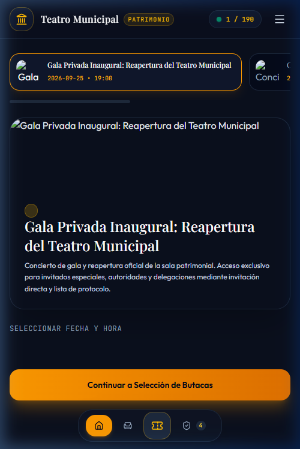
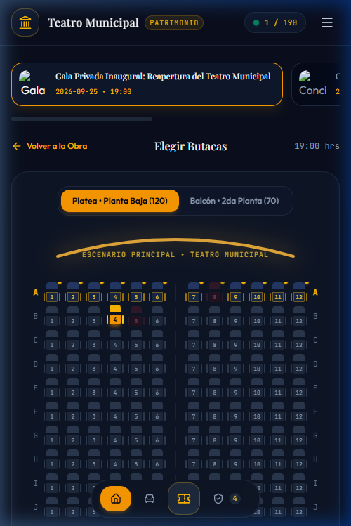
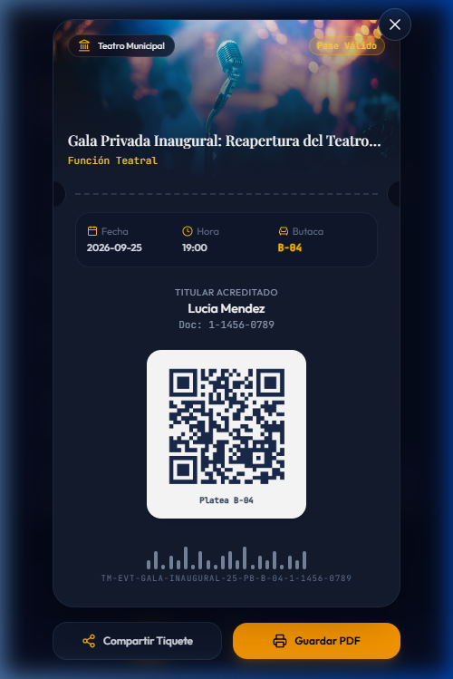
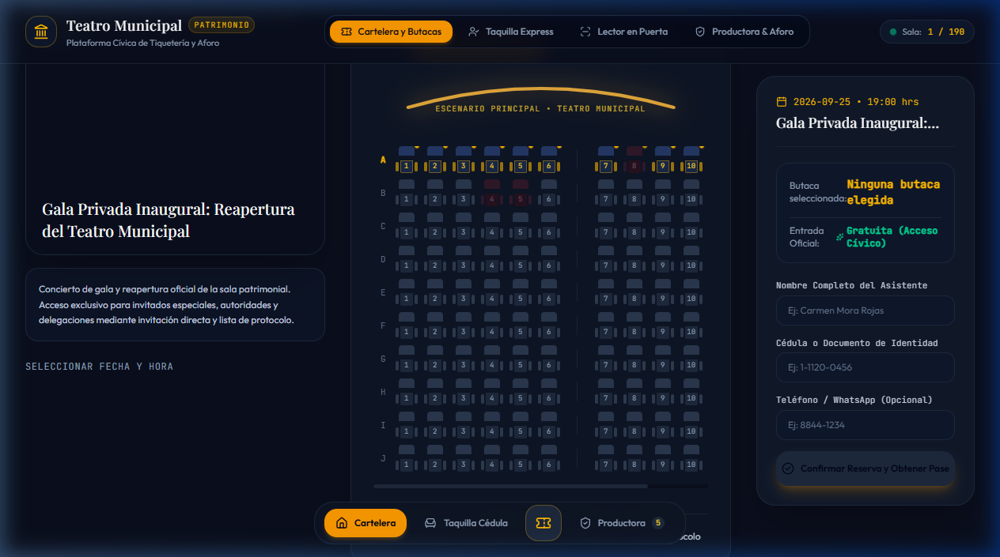
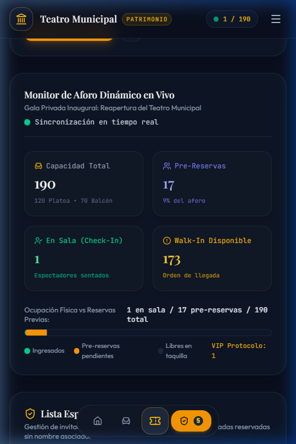

# Manual de Usuario: Sistema Cívico de Tiquetería y Gestión de Aforo
## Teatro Municipal • Dark Luxury Edition

Este manual ilustrado documenta la operación de las tres capas de acceso ciudadano y la consola de la productora del Teatro Municipal, rediseñadas con el estándar estético **Dark Luxury Cinema & Theater** y arquitectura UX Mobile-First y Panorámica de Escritorio.

---

## 1. Experiencia Ciudadana Móvil: Cartelera, Detalle y Horarios

Los ciudadanos acceden desde su smartphone a una interfaz cinematográfica oscura inmersiva (Azul Medianoche `#0a0f1d` y acentos dorados cálidos `#f59e0b`):

### Flujo de Selección:
1. **Carrusel de Obras**: Miniaturas en carrusel horizontal para alternar entre obras de la temporada.
2. **Tarjeta Hero con Sinopsis**: Póster teatral de alta definición, género de la obra (*Teatro Clásico*, *Danza Contemporánea*, etc.) y sinopsis cultural.
3. **Selector de Fecha y Hora**: Tarjetas de calendario horizontal (Día de la semana + Fecha) y píldoras de hora de función (ej. `19:00 hrs`).
4. **Botón Principal**: Al presionar *"Continuar a Selección de Butacas"*, el usuario avanza a la pantalla de selección de asientos.

---

## 2. Mapa 3D de Butacas y Arco de Proscenio Iluminado

La pantalla de butacas replica la experiencia visual de las aplicaciones de cine más sofisticadas, adaptada a la arquitectura del Teatro Municipal (190 asientos totales):

### Elementos del Mapa:
- **Arco de Proscenio**: Arco curvo con resplandor dorado escénico (*ESCENARIO PRINCIPAL • TEATRO MUNICIPAL*).
- **Selector de Nivel**: Pestañas táctiles para alternar entre **Platea (120 butacas)** y **Balcón (70 butacas)**.
- **Modelado 3D de Butacas**: Sillones esculpidos con respaldo, cojín y apoyabrazos:
  - *Gris grafito*: Butaca libre disponible.
  - *Rosa/Magenta*: Butaca ocupada.
  - *Dorado/Turquesa resplandeciente*: Butaca seleccionada por el usuario.
  - *Borde dorado + Icono Corona*: Fila VIP / Protocolo (Filas A y K).
- **Gaveta Inferior de Reserva**: Resumen del asiento seleccionado y formulario de acreditación inmediata (Nombre, Cédula y Teléfono).

---

## 3. Pase Físico Troquelado (Notched Cinema Ticket Pass)

Al confirmar la reserva, se despliega el tiquete digital con morfología de boleto físico tradicional:

### Anatomía del Boleto:
- **Muescas Circulares Laterales**: Ranuras cóncavas simétricas que simulan el corte troquelado de imprenta.
- **Cabecera Artística**: Póster oficial de la obra, monograma del Teatro Municipal e indicador *"Pase Válido"*.
- **Línea Punteada de Desprendimiento**: Separación visual del talón de entrada.
- **Doble Validación Cívica**:
  - **Código QR vectorial de alta densidad**: Para lectura instantánea mediante el escáner de cámara en puerta.
  - **Código de Barras alfanumérico**: Compatible con pistolas láser USB de ventanilla.
- **Acciones Rápidas**: Botón para *"Compartir Tiquete"* vía WhatsApp/Mensajería y *"Guardar PDF"*.

---

## 4. Experiencia Panorámica para Productora y Dirección (Escritorio)

Cuando el equipo de producción o dirección abre el sistema desde su computadora, la interfaz se expande a un diseño panorámico de 3 columnas simultáneas:

- **Columna Izquierda (4 columnas)**: Póster en gran formato, sinopsis de la obra y selector de fechas/horarios.
- **Columna Central (5 columnas)**: Plano completo de la sala con el proscenio dorado y las butacas en tiempo real.
- **Columna Derecha (3 columnas)**: Panel flotante sticky con el resumen del boleto y formulario de emisión.
- **Barra de Navegación Superior**: Acceso directo con un solo clic a *Cartelera y Butacas*, *Taquilla Express*, *Lector en Puerta* y *Productora & Aforo*.

---

## 5. Consola Administrativa de Producción y Monitor de Aforo

### Control Integral de Sala:
1. **Monitor de Aforo Dinámico**: Visualización en vivo de aforo total (220), cupos pre-reservados, asistentes en sala y entradas walk-in remanentes.
2. **Invitados Especiales y Protocolo**: Gestión de delegaciones (Alcaldía, Concejo, etc.) y emisión de pases VIP para filas A y K.
3. **Parámetros de Evento**: Conmutación entre modo de *Butacas Numeradas* y *Aforo General por Orden de Llegada*, habilitación/pausa de registros.

---

## 6. Operación Presencial a 1 Hora: Mesas de Atención y Acomodadores

A falta de una hora para el inicio de la función, se activa el protocolo presencial con dos mesas en el vestíbulo y personal de acomodadores en sala:

### Mesa 1: Registro Presencial & Walk-in
- **Asistente Inteligente de Grupos**: Al presionar *"Sugerir Grupo"*, el operador ingresa la cantidad de asistentes (1 a 6+), nombre y cédula del titular. El algoritmo sugiere la mejor ubicación contigua disponible o partición balanceada en filas cercanas.
- **Matriz de Sala**: Botón para proyectar la matriz de los 3 niveles con las butacas pre-seleccionadas e iluminadas.
- **QR de Auto-Registro en Mesa**: Botón para proyectar o imprimir el código QR que permite a los ciudadanos en fila auto-registrarse desde su teléfono (`?mode=walkin-kiosk`).

### Mesa 2: Puerta y Verificación Rápida
- **Escáner Óptico de Entrada**: Validación instantánea por cámara o ingreso de Código Rápido de 4 caracteres (ej. `SV08`) o cédula para acreditar a quienes reservaron con antelación.

### Sala: Pantalla para Acomodadores en Vivo
- **Feed Sincronizado en Tiempo Real**: Recepción inmediata vía `BroadcastChannel` de los espectadores conforme ingresan por taquilla o puerta.
- **Buscador Rápido**: Búsqueda instantánea por nombre, cédula o butaca.
- **Control de Ubicación**: Botón *"Marcar Ubicado"* para certificar que el espectador ya tomó asiento.

### Regla de Corte Web de 20 Minutos
- A falta de 20 minutos para el inicio, la boletería web pública se bloquea automáticamente para evitar colisiones con las personas presentes en el teatro. Los usuarios web son informados mediante un aviso cívico formal orientándolos a taquilla física.

---

## 7. Padrón Dinámico de Acreditación y Verificación de Entradas (Puerta)

Diseñado para la Gran Reapertura Oficial y funciones con reservaciones por lista o contingentes protocolares sin QR digital en mano.

### Modos de Operación en Puerta
En la parte superior del módulo **Puerta**, un conmutador segmentado permite alternar entre:
1. **`[📋 Padrón de Acreditación (Nombre / Cédula / Puesto)]`**: Modo activo predeterminado.
2. **`[📷 Escáner QR]`**: Lector de cámara óptica o digitación de código corto de 4 caracteres.

### Funcionalidades Clave del Padrón:
1. **Barra de Métricas Comprimida**: Panel superior sobrio y sin saturación con Convocados Totales, En Sala (con % de avance en vivo), Por Ingresar y Protocolo Acreditado.
2. **Búsqueda Reactiva Multi-Criterio**: Digite el Nombre, Cédula (con o sin guiones) o Butaca (ej. `A-08`). El filtrado es instantáneo. Presione `/` para enfocar o `Esc` para limpiar.
3. **Filtros Segmentados & Orden Inteligente**: Filtre por estado (*Todos*, *Pendientes*, *En Sala*, *Liberados*) o zona. El orden inteligente sitúa a los pendientes de ingresar al inicio alfabéticamente para agilizar la fila.
4. **Acreditación en 1 Clic & Deshacer**: Al pulsar *"Ingresar"*, el asistente queda acreditado inmediatamente y se muestra una notificación toast con botón *"Deshacer"* de 5 segundos en caso de error.
5. **Orientación de Butaca Inmediata**: Cada fila indica la puerta recomendada (*"Puerta Derecha • Fila A"*, *"Gradas Superiores (Balcón)"*) para orientar verbalmente al espectador.
6. **Registro Rápido In-situ**: El botón *"+ Registrar In-situ"* permite inscribir y acreditar inmediatamente a un invitado de última hora sin salir del módulo.

