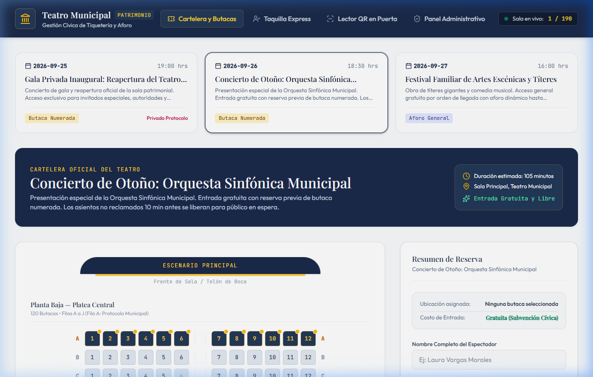
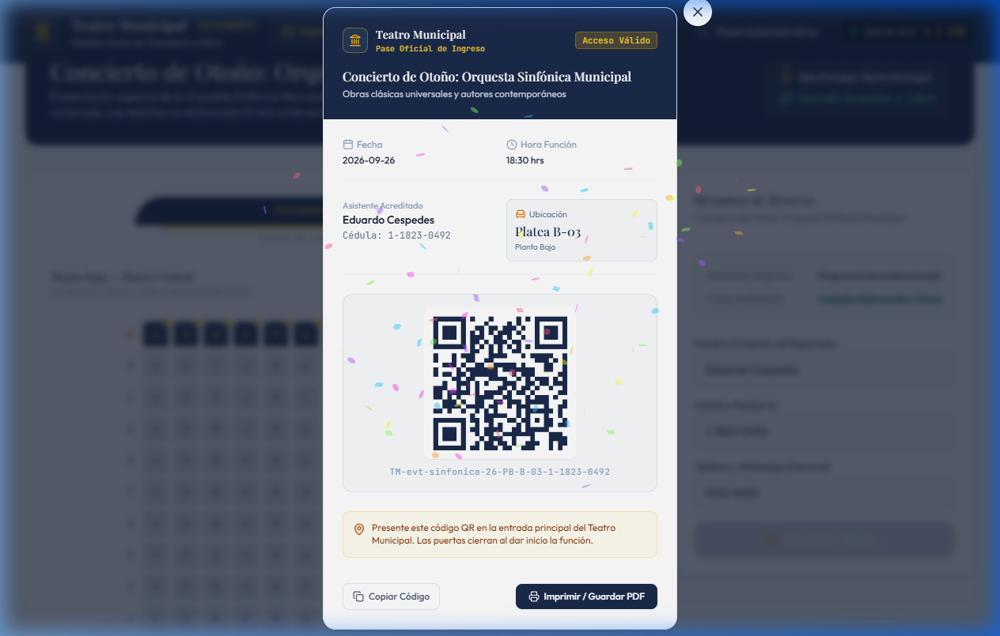
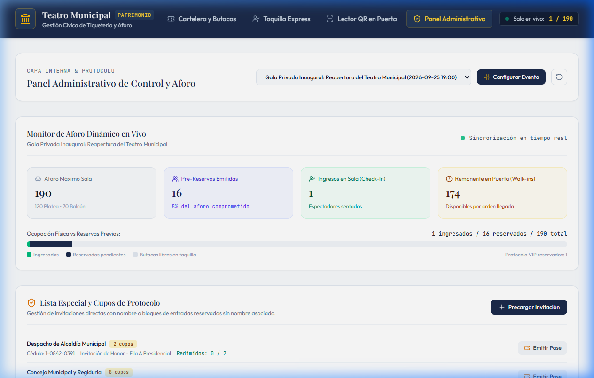

# Manual de Usuario: Sistema Cívico de Tiquetería y Gestión de Aforo
## Teatro Municipal

Este manual ilustrado documenta la operación de las tres capas de acceso ciudadano y el panel administrativo del Teatro Municipal.

---

## 1. Capa 3: Cartelera Ciudadana y Reserva Previa de Butacas

El portal público permite a los ciudadanos consultar la programación cultural de la temporada y reservar su localidad gratuita.

### Flujo de Reserva:
1. **Selección del Evento**: En la parte superior se presentan las obras activas con fecha, hora, duración y modalidad de sala.
2. **Plano Arquitectónico de Butacas**:
   - Para funciones con **Butacas Numeradas**, el sistema renderiza el plano de la sala con sus dos niveles: **Planta Baja / Platea (120 butacas)** y **Segunda Planta / Balcón (70 butacas)**.
   - Las filas **A** y **K** se encuentran reservadas de forma predeterminada para protocolo municipal y autoridades.
   - El ciudadano hace clic en cualquier butaca disponible para seleccionarla (se ilumina en tono dorado/latón escénico).
3. **Formulario Rápido (3 Campos)**:
   - Nombre completo del espectador.
   - Cédula de identidad o documento legal.
   - Teléfono / WhatsApp de contacto opcional.
4. **Confirmación**: Al pulsar *Confirmar Reserva*, el sistema emite el tiquete oficial al instante.

---

## 2. Capa 2: Acreditación Digital con Código QR y Validación en Puerta

Una vez confirmada la reserva, se despliega el pase digital oficial con código QR vectorial de alta definición.

### Características del Tiquete:
- **Identificación Oficial**: Monograma y sello institucional del Teatro Municipal.
- **Datos de Sala**: Fecha, hora exacta de la función, zona asignada y número de butaca.
- **Código QR Dinámico**: Contiene el identificador criptográfico único para lectura en puerta.
- **Instrucciones Cívicas**: Recordatorio de apertura de puertas (45 min antes) y política de liberación de butacas no reclamadas.
- **Opciones de Descarga**: Botones directos para copiar el código e imprimir o guardar en PDF.

### Validación en Puerta (Lector QR):
- Los acomodadores y personal de sala cuentan con la pestaña **Lector QR en Puerta**.
- Permite escanear mediante sensor de cámara, lector de código de barras USB o simulación rápida.
- **Feedback Sensorial Inmediato**:
  - *Verde*: Acceso permitido, mostrando nombre y butaca asignada.
  - *Ámbar*: Advertencia de tiquete ya utilizado previamente con indicación de la hora exacta de primer ingreso.
  - *Rojo*: Código inválido o desconocido.

---

## 3. Capa 1: Taquilla Express por Cédula (Ventanilla Presencial)

Diseñada para atención ultra-rápida de espectadores presenciales, adultos mayores o ventanilla de última hora:
- **Búsqueda Instantánea**: El operador digita la cédula del ciudadano y pulsa *Buscar*. Si cuenta con reserva, muestra los datos y un botón de un clic para **Validar e Ingresar a Sala**.
- **Registro Express en Puerta (Walk-In)**: Si el ciudadano llega directamente sin reserva previa y hay aforo remanente, el operador pulsa *Registro Express*, completa nombre y cédula, y el sistema emite la entrada e ingresa al asistente en 2 segundos.

---

## 4. Capa Administrativa y Monitor de Aforo en Tiempo Real

El panel administrativo proporciona control integral al equipo directivo y de protocolo.

### Capacidades del Panel:
1. **Monitor de Aforo Dinámico**:
   - Contrasta en tiempo real: Capacidad total (190), Pre-reservas emitidas, Asistentes efectivamente sentados en sala (Check-In) y Disponibilidad remanente en puerta para walk-ins.
2. **Gestión de Lista Especial y Protocolo**:
   - Precarga de invitaciones para eventos privados (como la Gala Inaugural del Viernes 25).
   - Soporte para invitaciones nominales o **bloques de entradas reservadas sin nombre asociado** (ej. delegaciones o regidurías).
   - Botón *Emitir Pase* para redimir cupos asignados.
3. **Configuración de Eventos**:
   - Habilitación o pausa manual de reservas públicas.
   - Alternancia de modalidad: Butacas Numeradas vs Aforo General por orden de llegada.
